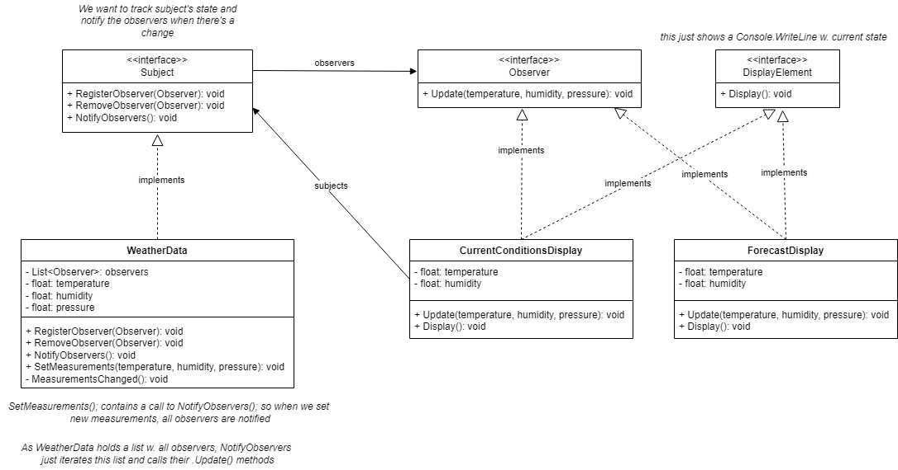
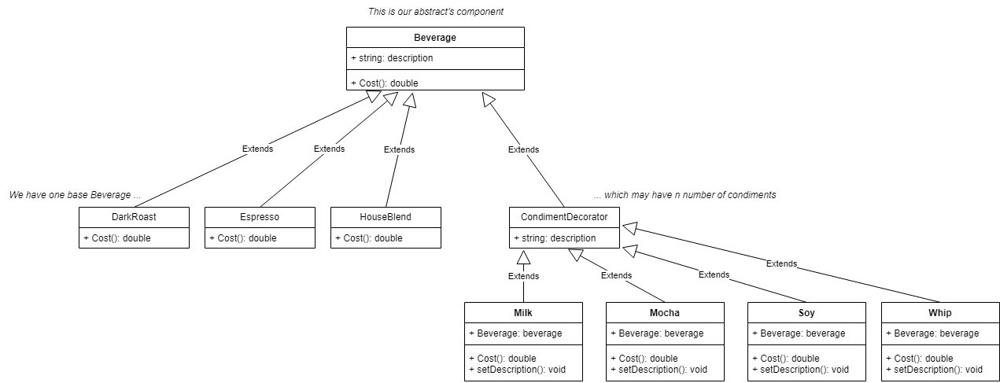
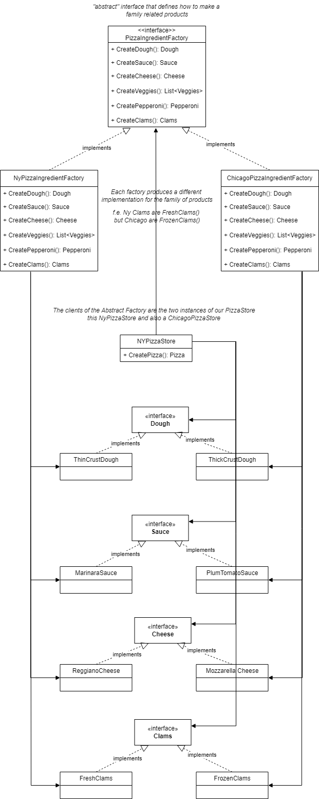
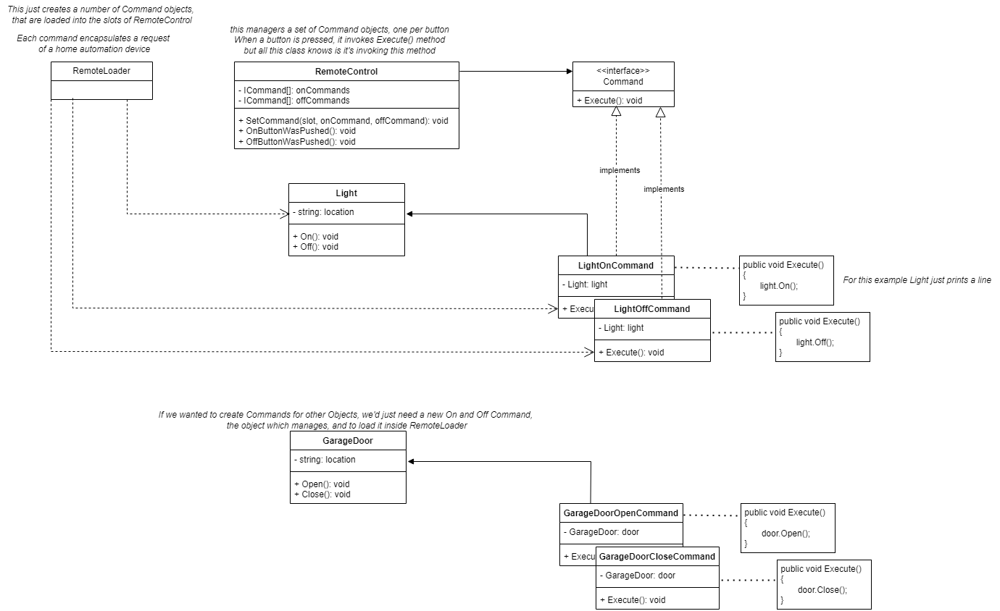
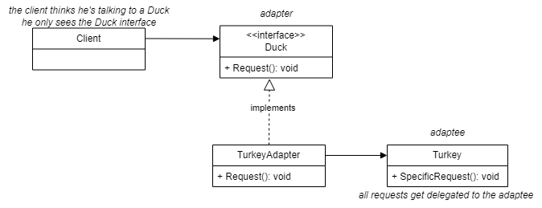
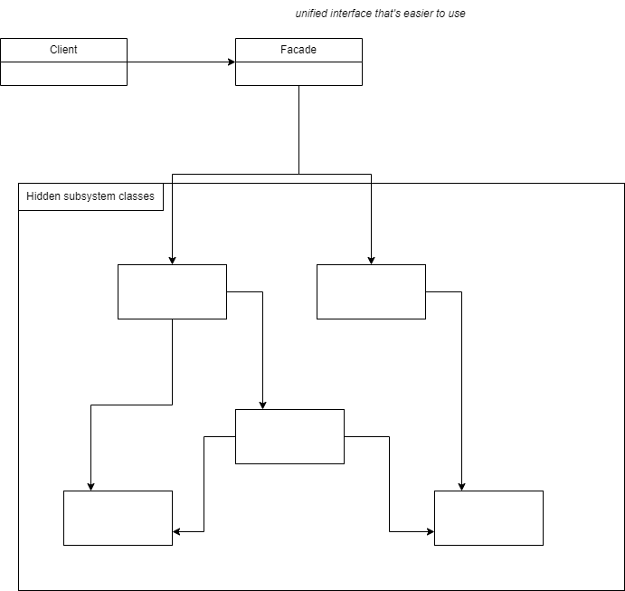
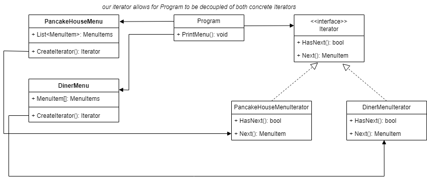

# Software architecture patterns - implemented in csharp

*(disclaimer: all this info is for personal use and comes from my understanding from the book [Head First Design Patterns](https://www.oreilly.com/library/view/head-first-design/0596007124/). For more info or details please purchase the book to support the original authors)*

## Design principles  
* Identify the aspects of your application that vary and separate them from what stays the same
* Program to an interface, not an implementation
* Favor composition over inheritance -> has-a may be better than is-a
* Strive for loosely coupled designs between objects that interact
* Classes should be open for extension, but closed for modification

## Strategy pattern
Define una familia de algoritmos, encapsulando cada uno de ellos y los hace intercambiables en runtime (configuración), independientemente de los clientes que los utilizan.  
Útil para cambiar algoritmos en tiempo de ejecución y elegir la estrategia más adecuada según el contexto. 

*code example - how to use it!*
~~~ csharp
Duck duck = new MallardDuck(new Quack(), new FlyNoWay());
duck.PerformQuack(); // quacks like a duck
duck.PerformFly(); // cannot fly
duck.Display(); // looks like a MallardDuck

Duck duck2 = new MallardDuck(new MuteQuack(), new FlyWithWings());
duck2.PerformQuack(); // <<silence>>
duck2.PerformFly(); // flying with wings
duck2.Display(); // looks like a MallardDuck

Duck duck3 = new RedheadDuck(new Squak(), new FlyWithWings());
duck3.PerformQuack(); // squeaks
duck3.PerformFly(); // flying with wings
duck3.Display(); // looks like a Redhead Duck
~~~

## Observer pattern
Define una relacion, de una a muchos, entre un sujeto con estado y sus observadores de manera que, cuando el sujeto cambia de estado, todos sus observadores son notificados y actualizados automáticamente.  

Facilita la notificación de cambios en un objeto a múltiples observadores. 

*code example - how to use it!*
~~~ csharp
WeatherData weatherData = new WeatherData();
DisplayElement currentDisplay = new CurrentConditionsDisplay(weatherData);
DisplayElement forecastDisplay = new ForecastDisplay(weatherData);

// SetMeasurements() calls NotifyObservers() and this calls Update() for all observers
// on Update() it calls Display() to see the change. this prints:
weatherData.SetMeasurements(80, 65, 30.4f);
//   currentConditionsDisplay: temp 80, humidity 65%
//   forecast display based on pressure: temp 80, humidity 65%

weatherData.SetMeasurements(40, 25, 28.5f);
//   currentConditionsDisplay: temp 40, humidity 25%
//   forecast display based on pressure: temp 40, humidity 25%
~~~

## Decorator pattern
Permite añadir nuevas funcionalidades a objetos de forma dinámica sin modificar su estructura interna.  
Funciona mediante wrappers que agregan comportamientos antes o después de delegar llamadas al objeto original.  

*code example - how to use it!*
~~~ csharp
Beverage beberage = new Espresso();
Console.WriteLine($"{beverage.Description} {beverage.Cost()}");
// Espresso $1,99

Beverage beverage2 = new DarkRoast();
beverage2 = new Mocha(beverage2);
Console.WriteLine($"{beverage2.Description} {beverage2.Cost()}");
// Dark roast, Mocha $1,45

Beverage beverage3 = new HouseBlend();
beverage3 = new Soy(beverage3);
beverage3 = new Mocha(beverage3);
beverage3 = new Whip(beverage3);
Console.WriteLine($"{beverage3.Description} {beverage3.Cost()}");
// House blend coffee, Soy, Mocha, Whip $1,74
~~~

## Factory pattern
Define una interfaz para crear un objeto, pero deja a las subclases decidir que tipo instanciar. Permite a una clase diferir la instanciación a sus subclases.  

Útil para cuando se trabaja con familias de objetos relacionados y se desea que todos los objetos que tienen que cooperar entre sí, provengan de la misma familia o tipo.  
Permite utilizar diferentes implementaciones para diferentes situaciones.  

*code example - how to use it*
~~~ csharp
PizzaStore nyStore = new NYPizzaStore();
PizzaStore chicagoStore = new ChicagoPizzaStore();

Pizza pizza = nyStore.OrderPizza("clam");
Pizza pizza = chicagoStore.OrderPizza("clam");
// ny pizza: New york style clam pizza w. thin crust dough, marinara sauce, reggiano cheese, fresh clams
// chicago pizza: Chicago style clam pizza w. thick crust dough, barbaque sauce, emmental cheese, frozen clams
~~~

## Singleton pattern
Asegura que una clase tiene una única instancia y ofrece un punto de acceso global a la misma

*code example - how to use it!*
~~~ csharp
public class SingletonService
{
  // eager loading because this is thread-safe
  private static SingletonService uniqueInstance = new SingletonService();

  // private constructor so there can be no initialization outside this class
  private SingletonService() {}

  private static SingletonService GetInstance()
  {
    return uniqueInstance();
  }
}
~~~

## Command pattern
Envuelve una solicitud como un objeto. Esto permite parametrizar objetos con diferentes solicitudes. Facilita la implementación de deshacer operaciones y rehacerlas.   

Útil cuando los productores son diferentes entre sí. 

*code example - how to use it!*
~~~ csharp
// set up
RemoteControl remote = new RemoteControl();

Light livingRoomLight = new Light("living room");
Light kitchenLight = new Light("kitchen");
GarageDoor garageDoor = new GarageDoor("");

// light commands
var livingRoomLightOn = new LightOnCommand(livingRoomLight);
var livingRoomLightOff = new LightOffCommand(livingRoomLight);
var kitchenLightOn = new LightOnCommand(kitchenLight);
var kitchenLightOff = new LightOffCommand(kitchenLight);

// garage door commands
var garageDoorUp = new GarageDoorUpCommand(garageDoor);
var garageDoorDown = new GarageDoorDownCommand(garageDoor);

// load commands into programmable remote
remote.SetCommand(0, livingRoomLightOn, livingRoomLightOff);
remote.SetCommand(1, kitchenLightOn, kitchenLightOff);
remote.SetCommand(2, garageDoorUp, garageDoorDown);

// push buttons
remote.OnButtonWasPushed(0); // living room light is on
remote.OffButtonWasPushed(0); // living room light is off

remote.OnButtonWasPushed(1); // kitchen light is on
remote.OffButtonWasPushed(1); // kitchen light is off

remote.OnButtonWasPushed(2); // garage door opens
remote.OffButtonWasPushed(2); // garage door closes
~~~

## Adapter pattern
Permite adaptar un diseño que espera una interfaz, a una clase que implementa otra interfaz completamente diferente. Permite trabajar juntas a clases que de otro modo serían incompatibles.

*code example - how to use it!*
~~~ csharp
// we have a Duck interface which Quacks
Duck duck = new MallardDuck();
duck.Quack();

// we have a Turkey interface which Gobbles
Turkey turkey = new WildTurkey();
turkey.Gobble();

// now we have a Turkey which knows how to Quack
Duck hiddenTurkey = new TurkeyAdapter(turkey);
hiddenTurkey.Quack();
~~~

## Façade pattern
Wrapper de objetos, parecido al adapter pero el objetivo del façade es simplificar la interfaz. Este patrón esconde la complejidad de una o más clases detrás de una fachada. 

## Template Method pattern
Define el esqueleto de un algoritmo defiriendo algunos pasos a sus subclases. Permite a las subclases redefinir algunos pasos del algoritmo sin cambiar la estructura interna del mismo.  

There's a version with a *hook* where it's possible to hide or omit parts of the algorithm depending on the subclass. 

*code example - how to **define** it*
~~~ csharp
// abstract parent class which has the template method
public abstract class CaffeineBeverage
{
  protected abstract void Brew();
  protected abstract void AddCondiments();

  // this is the template method itself. it's the method we call from the outside
  // we mark as abstract the methods that are supplied by subclasses 
  public void PrepareRecipe()
  {
    BoilWater();
    Brew();
    PourInCup();
    AddCondiments();
  }

  private void BoilWater() { ... }
  private void PourInCup() { ... }
}

public class Coffee : CaffeineBeverage
{
  protected override void Brew() { ... }
  protected override void AddCondiments() { ... }
}

public class Tea : CaffeineBeverage
{
  protected override void Brew() { ... }
  protected override void AddCondiments() { ... }
}
~~~

### Strategy vs template method patterns
They're similar in their purposes.  

* strategy pattern: <ins>define una familia de algoritmos</ins> y los hace intercambiables en runtime. Como cada algoritmo está encapsulado, el cliente puede usar varios algoritmos fácilmente. Es más flexible porque usa composición.
* template method pattern: define la base de un algoritmo, pero delega partes del trabajo en sus subclases. Permite tener <ins>diferentes implementaciones de un algoritmo</ins>, pero mantener el control sobre su estructura. Evita la repetición de código.

## Iterator pattern
Proporciona una manera de acceder secuencialmente a los elementos de un objeto, sin exponer su representación subyacente (nos da igual igual si es una List o un Array o su implementación).  
Encapsula la lógica de navegación. 

*code example - how to use it*
~~~ csharp
// this holds List<MenuItem> ... 
var pancakeHouseMenu = new PancakeHouseMenu();
Iterator pancakeIterator = pancakeHouseMenu.CreateIterator();

// this holds MenuItem[] ...
var dinerMenu = new DinerMenu();
Iterator dinerIterator = dinerMenu.CreateIterator();

// ... but we're able to iterate them both with the same method
PrintMenu(pancakeIterator);
PrintMenu(dinerIterator);
~~~

*ejemplo del metodo para hacer print*
~~~ csharp
private static void PrintMenu(Iterator iterator)
{
    while(iterator.HasNext())
    {
        MenuItem item = iterator.Next();
        Console.WriteLine($"menuItem {item._name}");
    }
}
~~~

## State pattern
Permite hacer un seguimiento del estado interno de un objeto y alterar el comportamiento del objeto en función de este estado interno.

