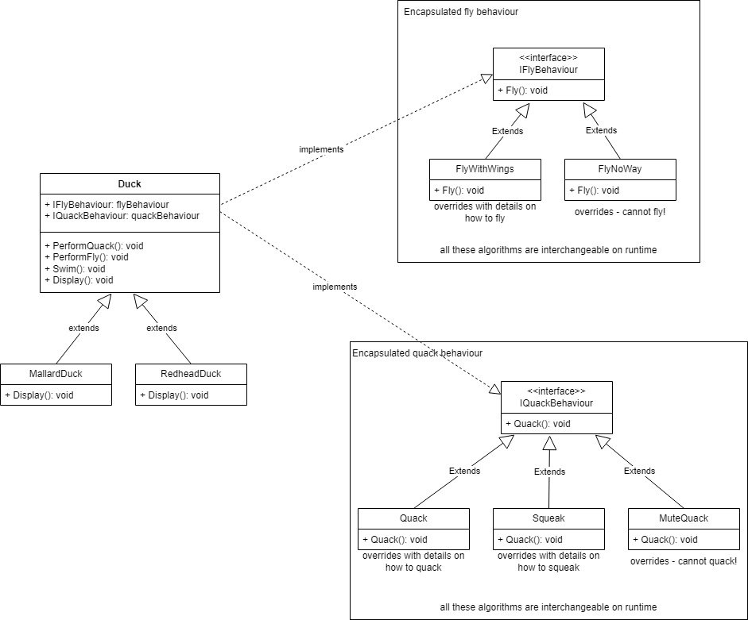

# Software architecture patterns - implemented in csharp

*(disclaimer: all this info is for personal use and comes from my understanding from the book [Head First Design Patterns](https://www.oreilly.com/library/view/head-first-design/0596007124/). For more info or details please purchase the book to support the original authors)*

Design principles:  
* Identify the aspects of your application that vary and separate them from what stays the same
* Program to an interface, not an implementation
* Favor composition over inheritance -> has-a may be better than is-a
* Strive for loosely coupled designs between objects that interact
* Classes should be open for extension, but closed for modification

## Strategy pattern
Define una familia de algoritmos, encapsulando cada uno de ellos y los hace intercambiables en runtime (configuración), independientemente de los clientes que los utilizan.  
Útil para cambiar algoritmos en tiempo de ejecución y elegir la estrategia más adecuada según el contexto. 

*code example - how to use it!*
~~~ csharp
Duck duck = new MallardDuck(new Quack(), new FlyNoWay());
duck.PerformQuack(); // quacks like a duck
duck.PerformFly(); // cannot fly
duck.Display(); // looks like a MallardDuck

Duck duck2 = new RedheadDuck(new Squak(), new FlyWithWings());
duck2.PerformQuack(); // squeaks
duck2.PerformFly(); // flying with wings
duck2.Display(); // looks like a Redhead Duck
~~~

## Observer pattern
Define una relacion, de una a muchos, entre un sujeto con estado y sus observadores de manera que, cuando el sujeto cambia de estado, todos sus observadores son notificados y actualizados automáticamente.  
Facilita la notificación de cambios en un objeto a múltiples observadores. 

## Decorator pattern
Permite añadir nuevas funcionalidades o responsabilidades a objetos de forma dinámica sin modificar su estructura interna. Funciona mediante wrappers que agregan comportamientos antes o después de delegar llamadas al objeto original.  

## Factory pattern
Define una interfaz para crear un objeto, pero deja a las subclases decidir que clase instanciar. Permite a una clase diferir la instanciación a sus subclases. 
Útil para cuando se trabaja con familias de objetos relacionados y se desea que todos los objetos que tienen que cooperar entre sí, provengan de la misma familia o tipo.  
Permite utilizar diferentes implementaciones para diferentes situaciones.  

## Singleton pattern
Asegura que una clase tiene una única instancia y ofrece un punto de acceso global a la misma