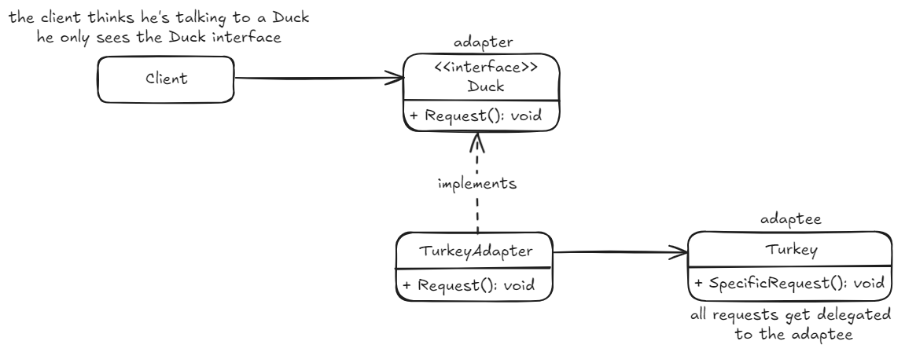

## Adapter pattern
Permite adaptar un diseño que espera una interfaz, a una clase que implementa otra interfaz completamente diferente. Permite trabajar juntas a clases que de otro modo serían incompatibles.

*code example - how to use it!*
~~~ csharp
// we have a Duck interface which Quacks
Duck duck = new MallardDuck();
duck.Quack();

// we have a Turkey interface which Gobbles
Turkey turkey = new WildTurkey();
turkey.Gobble();

// now we have a Turkey which knows how to Quack
Duck hiddenTurkey = new TurkeyAdapter(turkey);
hiddenTurkey.Quack();
~~~
