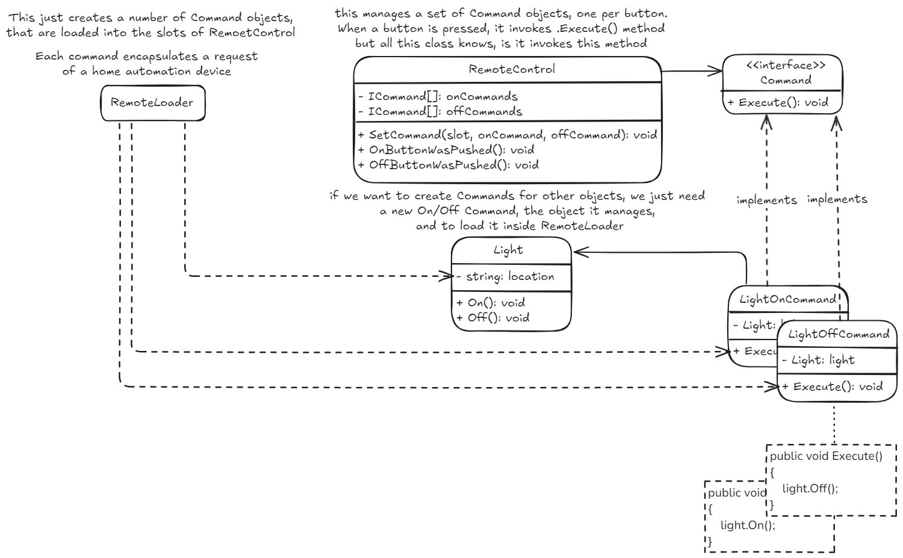

## Command pattern
Envuelve una solicitud como un objeto. Esto permite parametrizar objetos con diferentes solicitudes. Facilita la implementación de deshacer operaciones y rehacerlas.   

Útil cuando los productores son diferentes entre sí. 

*code example - how to use it!*
~~~ csharp
// set up
RemoteControl remote = new RemoteControl();

Light livingRoomLight = new Light("living room");
Light kitchenLight = new Light("kitchen");
GarageDoor garageDoor = new GarageDoor("");

// light commands
var livingRoomLightOn = new LightOnCommand(livingRoomLight);
var livingRoomLightOff = new LightOffCommand(livingRoomLight);
var kitchenLightOn = new LightOnCommand(kitchenLight);
var kitchenLightOff = new LightOffCommand(kitchenLight);

// garage door commands
var garageDoorUp = new GarageDoorUpCommand(garageDoor);
var garageDoorDown = new GarageDoorDownCommand(garageDoor);

// load commands into programmable remote
remote.SetCommand(0, livingRoomLightOn, livingRoomLightOff);
remote.SetCommand(1, kitchenLightOn, kitchenLightOff);
remote.SetCommand(2, garageDoorUp, garageDoorDown);

// push buttons
remote.OnButtonWasPushed(0); // living room light is on
remote.OffButtonWasPushed(0); // living room light is off

remote.OnButtonWasPushed(1); // kitchen light is on
remote.OffButtonWasPushed(1); // kitchen light is off

remote.OnButtonWasPushed(2); // garage door opens
remote.OffButtonWasPushed(2); // garage door closes
~~~
