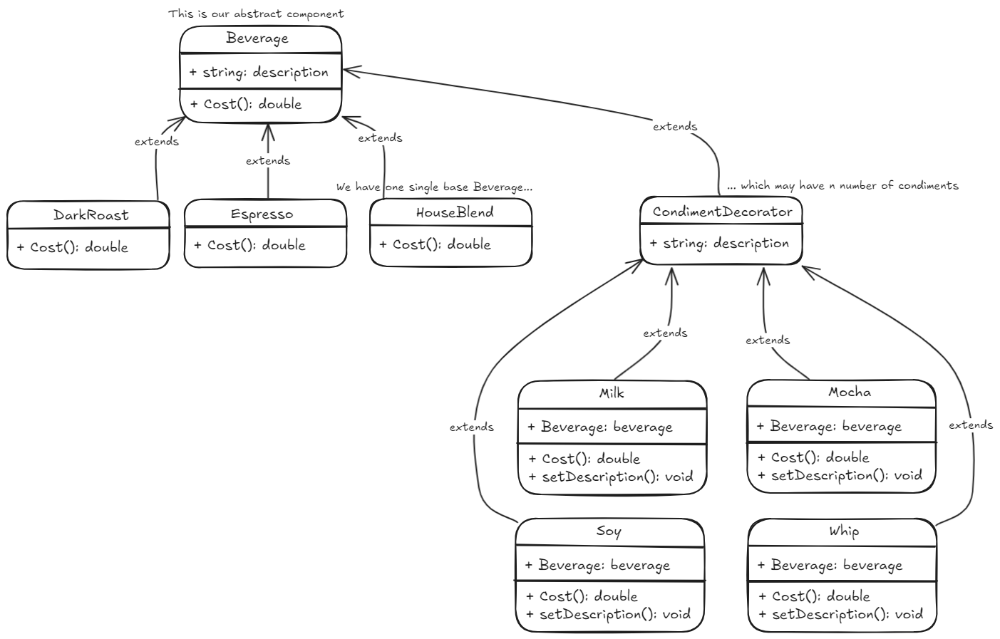

## Decorator pattern
Permite añadir nuevas funcionalidades a objetos de forma dinámica sin modificar su estructura interna.  
Funciona mediante wrappers que agregan comportamientos antes o después de delegar llamadas al objeto original.  

*code example - how to use it!*
~~~ csharp
Beverage beberage = new Espresso();
Console.WriteLine($"{beverage.Description} {beverage.Cost()}");
// Espresso $1,99

Beverage beverage2 = new DarkRoast();
beverage2 = new Mocha(beverage2);
Console.WriteLine($"{beverage2.Description} {beverage2.Cost()}");
// Dark roast, Mocha $1,45

Beverage beverage3 = new HouseBlend();
beverage3 = new Soy(beverage3);
beverage3 = new Mocha(beverage3);
beverage3 = new Whip(beverage3);
Console.WriteLine($"{beverage3.Description} {beverage3.Cost()}");
// House blend coffee, Soy, Mocha, Whip $1,74
~~~
