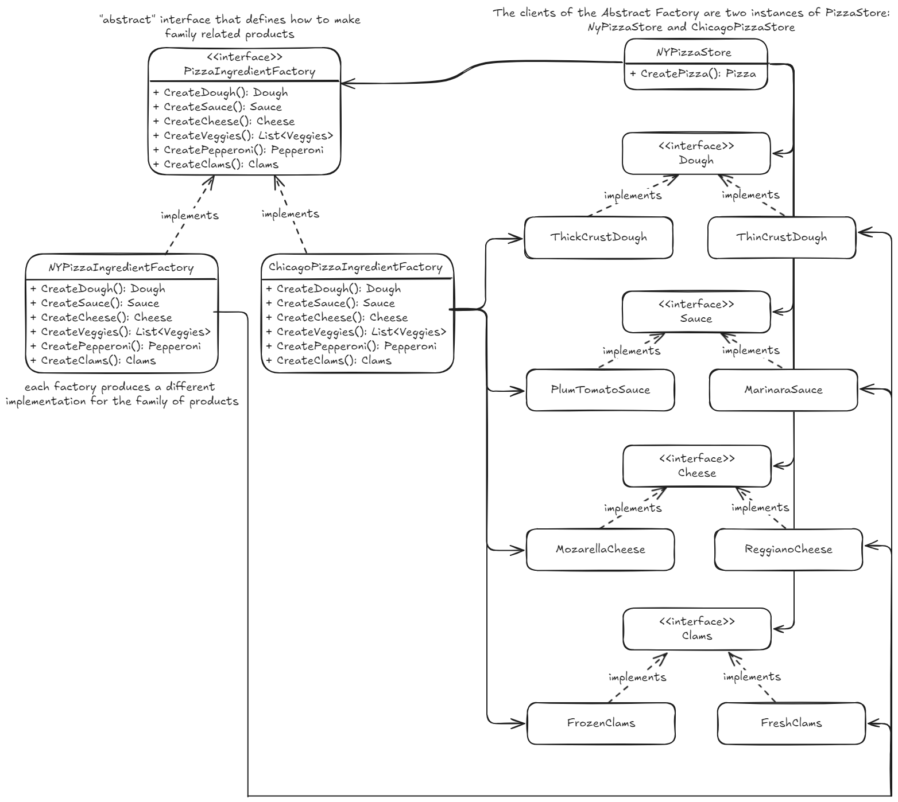

## Factory pattern
Define una interfaz para crear un objeto, pero deja a las subclases decidir que tipo instanciar. Permite a una clase diferir la instanciación a sus subclases.  

Útil para cuando se trabaja con familias de objetos relacionados y se desea que todos los objetos que tienen que cooperar entre sí, provengan de la misma familia o tipo.  
Permite utilizar diferentes implementaciones para diferentes situaciones.  

*code example - how to use it*
~~~ csharp
PizzaStore nyStore = new NYPizzaStore();
PizzaStore chicagoStore = new ChicagoPizzaStore();

Pizza pizza = nyStore.OrderPizza("clam");
Pizza pizza = chicagoStore.OrderPizza("clam");
// ny pizza: New york style clam pizza w. thin crust dough, marinara sauce, reggiano cheese, fresh clams
// chicago pizza: Chicago style clam pizza w. thick crust dough, barbaque sauce, emmental cheese, frozen clams
~~~
