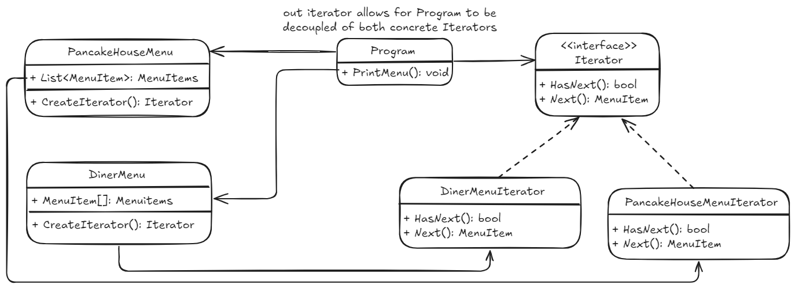

## Iterator pattern
Proporciona una manera de acceder secuencialmente a los elementos de un objeto, sin exponer su representación subyacente (nos da igual igual si es una List o un Array o su implementación).  
Encapsula la lógica de navegación. 

*code example - how to use it*
~~~ csharp
// this holds List<MenuItem> ... 
var pancakeHouseMenu = new PancakeHouseMenu();
Iterator pancakeIterator = pancakeHouseMenu.CreateIterator();

// this holds MenuItem[] ...
var dinerMenu = new DinerMenu();
Iterator dinerIterator = dinerMenu.CreateIterator();

// ... but we're able to iterate them both with the same method
PrintMenu(pancakeIterator);
PrintMenu(dinerIterator);
~~~

*ejemplo del metodo para hacer print*
~~~ csharp
private static void PrintMenu(Iterator iterator)
{
    while(iterator.HasNext())
    {
        MenuItem item = iterator.Next();
        Console.WriteLine($"menuItem {item._name}");
    }
}
~~~
