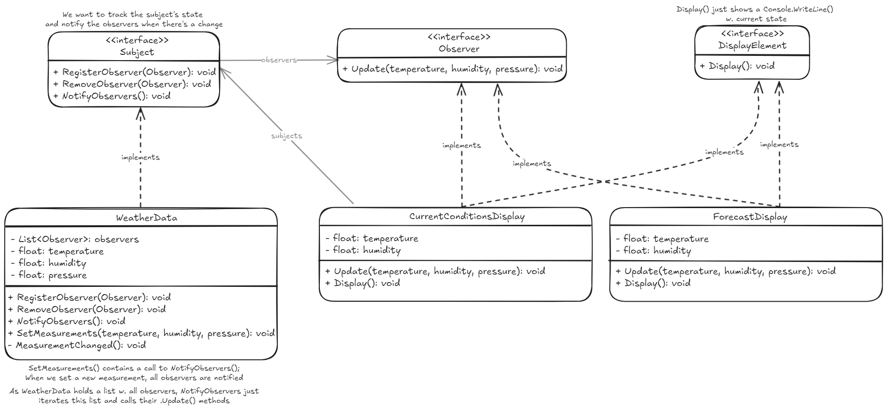

## Observer pattern
Define una relacion, de una a muchos, entre un sujeto con estado y sus observadores de manera que, cuando el sujeto cambia de estado, todos sus observadores son notificados y actualizados automáticamente.  

Facilita la notificación de cambios en un objeto a múltiples observadores. 

*code example - how to use it!*
~~~ csharp
WeatherData weatherData = new WeatherData();
DisplayElement currentDisplay = new CurrentConditionsDisplay(weatherData);
DisplayElement forecastDisplay = new ForecastDisplay(weatherData);

// SetMeasurements() calls NotifyObservers() and this calls Update() for all observers
// on Update() it calls Display() to see the change. this prints:
weatherData.SetMeasurements(80, 65, 30.4f);
//   currentConditionsDisplay: temp 80, humidity 65%
//   forecast display based on pressure: temp 80, humidity 65%

weatherData.SetMeasurements(40, 25, 28.5f);
//   currentConditionsDisplay: temp 40, humidity 25%
//   forecast display based on pressure: temp 40, humidity 25%
~~~
