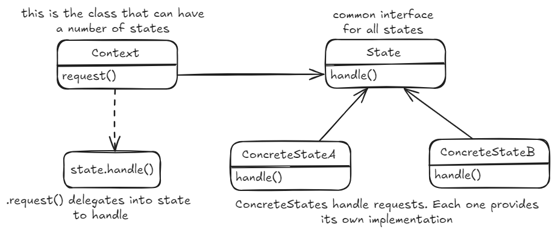

## State pattern
Permite hacer un seguimiento del estado interno de un objeto y alterar el comportamiento del objeto en función de este estado interno.

*code example - how to use it*
~~~ csharp
public class GumballMachine : IGumballMachine
{
  // possible states
  // the states themselves encapsulate all details on how to execute operations
  public IState _noQuarterState {get; set;}
  public IState _hasQuarterState {get; set;}
  public IState _soldState {get; set;}

  // current state
  public IState _state {get; set;}

  public GumballMachine()
  {
    _noQuarterState = new NoQuarterState(this);
    _hasQuarterState = new HasQuarterState(this);
    _soldState = new SoldState(this);
  }

  // we delegate all operations to the state itself
  public void InsertQuarter()
  {
    _state.InsertQuarter();
  }

  public void TurnCrank()
  {
    _state.TurnCrank();
  }
}
~~~

*from the outside of the context there's no visibility to the internal state*
~~~ csharp
IGumballMachine machine = new GumballMachine(1);
machine.InsertQuarter();
machine.TurnCrank();
machine.ReleaseBall();
~~~

### Strategy vs state method patterns
They're similar but they differ in their purposes.  

* strategy pattern: <ins>define una familia de algoritmos o estrategias</ins>. Se pueden cambiar en runtime, pero por lo general siempre hay un algoritmo o estrategia más apropiado para contexto y es raro que cambie.  
* state pattern: <ins>define una familia de comportamientos</ins> encapsulados en estados. Estos estados cambian en función del estado interno del contexto. Todo queda encapsulado dentro del contexto. El cliente no sabe nada del estado interno del contexto.
