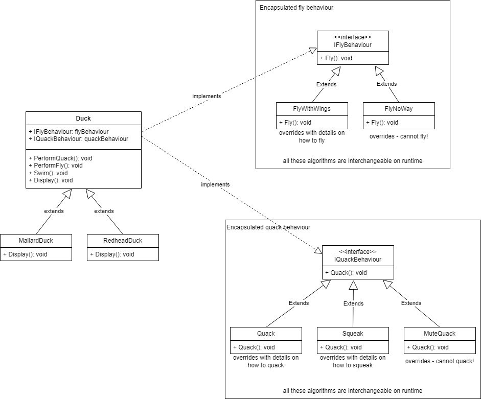

# Strategy Pattern

We decouple the behaviour from the class. The duck doesn't know implementation details about how to fly. This behaviour lives in a separate class - one that implements this behavior's interface. (IFlyBehavior - FlyWithWings).
This behavior may be changed at runtime!

The key is that a Duck delegates its flying behavior, instead of using defined flying methods inside its class. 

The strategy pattern defines a family of algorithms, encapsulates each one and makes them interchangeable. Strategy lets the algorithm vary independently from clients that use it. 

*code example - how to use it!*
~~~ csharp
Duck duck = new MallardDuck(new Quack(), new FlyNoWay());
duck.PerformQuack(); // quacks like a duck
duck.PerformFly(); // cannot fly
duck.Display(); // looks like a MallardDuck

Duck duck2 = new RedheadDuck(new Squak(), new FlyWithWings());
duck2.PerformQuack(); // squeaks
duck2.PerformFly(); // flying with wings
duck2.Display(); // looks like a Redhead Duck
~~~