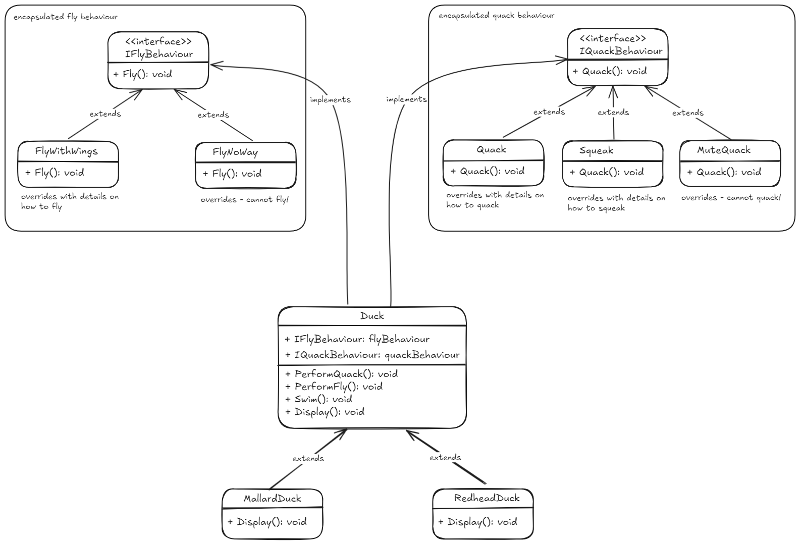

## Strategy pattern
Define una familia de algoritmos, encapsulando cada uno de ellos y los hace intercambiables en runtime (configuración), independientemente de los clientes que los utilizan.  
Útil para cambiar algoritmos en tiempo de ejecución y elegir la estrategia más adecuada según el contexto. 

*code quick example!*
~~~ csharp
Duck duck = new MallardDuck(new Quack(), new FlyNoWay());
duck.PerformQuack(); // quacks like a duck
duck.PerformFly(); // cannot fly
duck.Display(); // looks like a MallardDuck

Duck duck2 = new MallardDuck(new MuteQuack(), new FlyWithWings());
duck2.PerformQuack(); // <<silence>>
duck2.PerformFly(); // flying with wings
duck2.Display(); // looks like a MallardDuck

Duck duck3 = new RedheadDuck(new Squak(), new FlyWithWings());
duck3.PerformQuack(); // squeaks
duck3.PerformFly(); // flying with wings
duck3.Display(); // looks like a Redhead Duck
~~~

### Strategy vs template method patterns
They're similar in their purposes.  

* strategy pattern: <ins>define una familia de algoritmos</ins> y los hace intercambiables en runtime. Como cada algoritmo está encapsulado, el cliente puede usar varios algoritmos fácilmente. Es más flexible porque usa composición.
* template method pattern: define la base de un algoritmo, pero delega partes del trabajo en sus subclases. <ins>Permite tener diferentes implementaciones de un algoritmo</ins>, pero mantener el control sobre su estructura. Evita la repetición de código.
