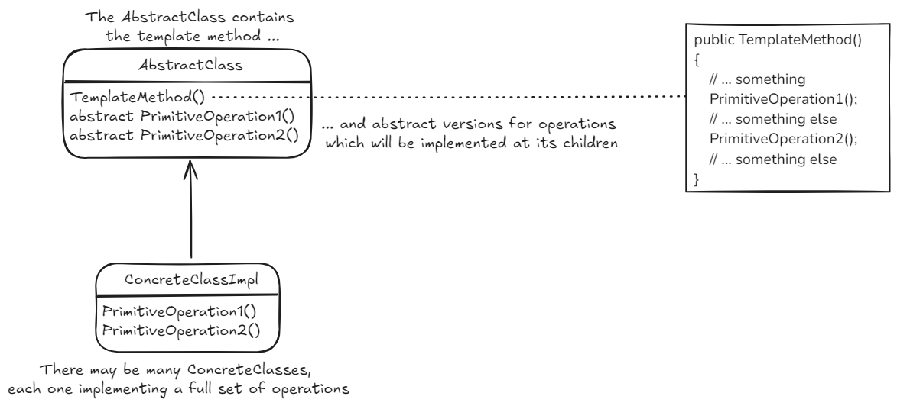

# Template Method Pattern
## Old Desc

We decouple the behaviour from the class. The duck doesn't know implementation details about how to fly. This behaviour lives in a separate class - one that implements this behavior's interface. (IFlyBehavior - FlyWithWings).
This behavior may be changed at runtime!

The key is that a Duck delegates its flying behavior, instead of using defined flying methods inside its class. 

---

## New desc
Define el esqueleto de un algoritmo defiriendo algunos pasos a sus subclases. Permite a las subclases redefinir algunos pasos del algoritmo sin cambiar la estructura interna del mismo.  

There's a version with a *hook* where it's possible to hide or omit parts of the algorithm depending on the subclass. 

*code example - how to **define** it*
~~~ csharp
// abstract parent class which has the template method
public abstract class CaffeineBeverage
{
  protected abstract void Brew();
  protected abstract void AddCondiments();

  // this is the template method itself. it's the method we call from the outside
  // we mark as abstract the methods that are supplied by subclasses 
  public void PrepareRecipe()
  {
    BoilWater();
    Brew();
    PourInCup();
    AddCondiments();
  }

  private void BoilWater() { ... }
  private void PourInCup() { ... }
}

public class Coffee : CaffeineBeverage
{
  protected override void Brew() { ... }
  protected override void AddCondiments() { ... }
}

public class Tea : CaffeineBeverage
{
  protected override void Brew() { ... }
  protected override void AddCondiments() { ... }
}
~~~

### Strategy vs template method patterns
They're similar in their purposes.  

* strategy pattern: <ins>define una familia de algoritmos</ins> y los hace intercambiables en runtime. Como cada algoritmo está encapsulado, el cliente puede usar varios algoritmos fácilmente. Es más flexible porque usa composición.
* template method pattern: define la base de un algoritmo, pero delega partes del trabajo en sus subclases. <ins>Permite tener diferentes implementaciones de un algoritmo</ins>, pero mantener el control sobre su estructura. Evita la repetición de código.
